# CourseFlix Architectural Migration Inventory & Map (MIGRATION_MAP.md)

This document provides a comprehensive inventory and dependency mapping of the CourseFlix codebase. It catalogs every major feature, global variable, global function, IndexedDB store, `localStorage` key, custom event, DOM dependency, and subsystem interaction before any code is migrated or removed.

---

## 1. System Inventory

### A. IndexedDB Stores & Schemas
Database: **`CourseFlixDB`** | Version: **`13`**

| Store Name | Key Path | Auto Increment | Indices | Purpose / Data Structure |
| :--- | :--- | :--- | :--- | :--- |
| **`courses`** | `id` | No | None | Stores course objects: metadata (`id`, `title`, `order`, `rating`, `faculty`, `ignored`, `stats`, `subcoursesStats`), handles (`handle`), file lists (`lectures`), subfolder hierarchies (`subfolders`), custom course definitions. |
| **`progress`** | `id` | No | None | Stores lecture progress records (`${courseId}_${lectureId}`): `currentTime`, `duration`, `completed`, `lastPlayed`, `customBookmarkTime`, `bookmarks` array, `notes`, `attachments` (PDFs, DPPs). |
| **`dpps`** | `id` | Yes | None | Stores DPP records: `courseId`, `folderName`, `fileName`, `fileHandle`, `completed`, `timestamp`, `isDeleted`. |
| **`doubts`** | `id` | Yes | None | Stores doubt screenshots and notes: `courseId`, `lectureId`, `courseTitle`, `lectureName`, `screenshot` (base64 data URL), `notes`, `timestamp`, `tags` array, `status`. |
| **`history`** | `id` | Yes | None | Stores chronological watch history records: `courseId`, `lectureId`, `courseTitle`, `lectureName`, `duration`, `subfolder`, `thumbnail`, `timestamp`, `hidden`. |
| **`calendarEvents`**| `id` | Yes | `date` (non-unique)| Stores study plan blocks and target planner events: `date` (`YYYY-MM-DD`), `title`, `courseId`, `lectureId`, `startMin`, `durationMin`, `faculty`, `color`, `completed`. |

---

### B. Global Variables Attached to `window`

| Variable Name | Type / Description | Read By | Written By | Risk / Criticality |
| :--- | :--- | :--- | :--- | :--- |
| `window.courses` | `Array<Course>` — In-memory list of all courses | `legacy.js`, `Navbar.jsx`, `services/*`, view renderers | `loadCoursesFromDB`, `processAndAddCourseFolder`, reorder | **CRITICAL** (Central state store) |
| `window.courseProgress` | `Object<id, Progress>` — Map of all lecture progress objects | `legacy.js`, `playerService`, `progressService`, stats calculators | `loadAllProgress`, `saveLectureProgress` | **CRITICAL** (Central state store) |
| `window.db` | `IDBDatabase` instance | All DB helper functions | `openDB`, `ensureDB` | **HIGH** |
| `window.appDbInitialized`| `Boolean` flag | DB opening guards | `openDB` | **MEDIUM** |
| `window.currentCourse` / `window.currentActiveCourse` | `Course` — Currently playing course | Player, Bookmark, Notes, DPP handlers | `renderPlayer`, `playVideo` | **CRITICAL** |
| `window.currentLectureId` / `window.currentActiveLectureId` | `String|Number` — Active lecture ID | Player, Timeline, Notes, Bookmarks | `renderPlayer`, `playVideo` | **CRITICAL** |
| `window.currentSubfolder` | `String` — Current subfolder path in player/view | Player, Breadcrumbs, Subcourse views | `renderSubcourseView`, `renderPlayer` | **HIGH** |
| `window.lastView` | `String` — Previous view ID for back button routing | Navigation, Back link handlers | `switchView`, `renderPlayer` | **MEDIUM** |
| `window.isGoalsMode` / `window.isCalendarMode` | `Boolean` — Active playlist mode flag | Player next/previous navigation | `renderGoalsPlayer`, `renderCalendarPlayer` | **MEDIUM** |
| `window.currentGoalsLectures` / `window.currentCalendarLectures` | `Array` — Active playlist queue items | Player next/previous navigation | `renderGoalsPlayer`, `renderCalendarPlayer` | **MEDIUM** |
| `window.calendarUndoStack` | `Array<{action, event}>` | Calendar undo actions | `addCalendarEvent`, `deleteCalendarEvent` | **LOW** |
| `window.isUndoingCalendar` | `Boolean` guard flag | Calendar event listeners | Undo handler | **LOW** |
| `window.timePillRotationTimer` | `IntervalID` | Total time left banner | `updateTotalTimeLeftDisplay` | **LOW** |
| `window.activePlaybackRate` | `Number` | Player speed controls | `settingsService`, player speed handlers | **MEDIUM** |
| `window.globalSearchMode` | `String` ('all', 'courses', 'lectures', 'notes') | Search view | `handleSearchInput` | **LOW** |
| `window.lastViewedFaculty` | `String` | Faculty view routing | `openFacultyProfile` | **LOW** |
| `window.customLectureTracking` | `Object` | Custom course lecture tracking | Custom player | **MEDIUM** |
| `window.savedTimelinePosition` | `Number` | Timeline position restoration | Player seek handlers | **LOW** |

---

### C. Global Functions Attached to `window`

| Global Function | Parameters | Defined In | Primary Callers | Purpose |
| :--- | :--- | :--- | :--- | :--- |
| `window.initCourseFlix` | `()` | `legacy.js` | `App.jsx` | Main application bootstrap entry point. |
| `window.openDB` | `()` | `legacy.js` / `db.js` | Startup, IDB operations | Initializes/resolves IndexedDB connection. |
| `window.ensureDB` | `()` | `legacy.js` / `db.js` | Repositories, Services | Ensures IDB is open before queries. |
| `window.getStore` | `(storeName, mode)` | `legacy.js` / `db.js` | Repositories, Services | Retrieves an IDB object store transaction. |
| `window.parseCourseId` | `(raw)` | `legacy.js` / `db.js` | Throughout codebase | Normalizes numeric/string course IDs. |
| `window.switchView` | `(viewId, pushState)` | `legacy.js` | `Navbar.jsx`, Views, Cards | Navigates between views and updates URL hash. |
| `window.renderCourseGrid` | `()` | `legacy.js` | Startup, mutations, sort | Renders dashboard course cards into DOM `#course-grid`. |
| `window.renderSubcourseView` | `(courseId, basePath)` | `legacy.js` | Dashboard cards, breadcrumbs | Renders subcourse folder drill-down view. |
| `window.renderPlayer` | `(courseId, lectureId, originView, startTime, subfolder)` | `legacy.js` | Dashboard, Subcourse, History | Renders video player and chapter sidebar. |
| `window.playLectureFromAnywhere`| `(courseId, lectureId, originView, subfolder)` | `legacy.js` | Continue, History, Search | Resolves course/lecture and launches player. |
| `window.calculateCourseProgress`| `(course, forceRecalc, targetSubfolder)` | `legacy.js` | Dashboard, Subcourses, Stats | Calculates completed %, remaining duration, total lectures. |
| `window.invalidateCourseProgressCache` | `(courseId)` | `legacy.js` | Progress writes, player | Clears cached progress stats for recalculation. |
| `window.loadCoursesFromDB` | `()` | `legacy.js` | Startup, upload, refresh | Loads all courses from IndexedDB into `window.courses`. |
| `window.loadAllProgress` | `()` | `legacy.js` | Startup, refresh | Loads all progress records into `window.courseProgress`. |
| `window.saveLectureProgress`| `(data)` | `legacy.js` | Player, DPP, Notes | Writes progress to IndexedDB and memory map. |
| `window.getLectureProgress` | `(courseId, lectureId)` | `legacy.js` | Player, Cards, Chapters | Reads progress record for specific lecture. |
| `window.triggerAddCourseFolder` | `()` | `legacy.js` | Dashboard drop, Navbar `+` | Invokes directory picker to add new course folder. |
| `window.triggerAddSubcourse`| `()` | `legacy.js` | Subcourse view header | Adds subfolder / extra directory handle. |
| `window.refreshCourse` | `(courseId, btnElement)` | `legacy.js` | Course Card menu | Scans filesystem handle for newly added lectures. |
| `window.hardDeleteHistoryForSubfolder` | `(courseId, subfolder)` | `legacy.js` | Subcourse deletion | Cleans history records on subfolder deletion. |
| `window.cleanupOrphanedHistoryEntries` | `()` | `legacy.js` | Startup, cleanup modal | Purges history records for nonexistent lectures. |
| `window.purgeAllDataForDeletedCoursesAndSubfolders` | `(options)` | `legacy.js` | Settings / Maintenance | Full database garbage collection across all stores. |
| `window.openGlobalSearchShortcut` | `()` | `legacy.js` | `App.jsx` (`Ctrl+Space`) | Focuses global search input and opens search view. |
| `window.closeSearchAndReturnToOrigin` | `()` | `legacy.js` | `App.jsx` (`Escape`) | Closes search view and restores previous view. |
| `window.openSettingsModal` | `()` | `legacy.js` / `settingsService` | Navbar, Dashboard gear icon | Displays settings overlay modal. |
| `window.openCalendarView` | `(targetDate)` | `legacy.js` | Plan view, Nav planner | Renders calendar study schedule. |
| `window.renderCalendarDay` | `(dateStr, isUnlocked)`| `legacy.js` | Calendar Day grid | Renders time blocks and study items for a day. |
| `window.makeCalendarPlaylist` | `(dateStr, isUnlocked, onDone)` | `legacy.js` | Calendar day actions | Builds sequential playlist of day's lectures. |
| `window.renderFacultyView` | `()` | `legacy.js` | Navbar faculty link | Renders teacher directory and stats. |
| `window.openFacultyProfile`| `(facultyName, originView)`| `legacy.js` | Faculty cards, course tags | Displays detailed faculty profile and courses. |
| `window.openSubjectPage` | `(subjectName)` | `legacy.js` | Subject cards, Dashboard | Displays subject drilldown page. |
| `window.renderIntellView` / `renderIntellCourse` / `renderIntellNote` | `(...)` | `legacy.js` | Intell navigation | Renders Intell notes viewer and search. |
| `window.jumpToLectureFromIntell` | `(courseId, lectureId, time)` | `legacy.js` | Intell note timestamps | Jumps from note timestamp directly into player. |
| `window.renderBookmarks` / `addBookmark` / `cycleBookmarks` | `(...)` | `legacy.js` | Player UI, `Z` key | Manages timestamped lecture bookmarks. |
| `window.clearCurrentVideoBookmarks` | `()` | `legacy.js` | Player bookmark popover | Deletes all bookmarks for active lecture. |
| `window.togglePdfViewer` | `()` | `legacy.js` | Player notes button, `Shift+N` | Toggles split PDF notes viewer iframe in player. |
| `window.togglePlayerNotesPanel` | `()` | `legacy.js` | Player notes button | Toggles rich-text player notes drawer. |
| `window.togglePlayerDppPanel` | `()` | `legacy.js` | Player DPP button | Toggles DPP drawer in player. |
| `window.cycleOrOpenRightSidePanel` | `()` | `legacy.js` | Keyboard shortcuts | Cycles right-hand side panels in player. |
| `window.toggleNoteHighlight` | `()` | `legacy.js` | Notes toolbar | Applies highlight formatting to selected text. |
| `window.loadPlayerNotes` / `savePlayerNotes` | `(...)` | `legacy.js` | Player notes lifecycle | Loads/saves rich-text lecture notes to IDB. |
| `window.renderDppCourseSelectionView` / `renderDppDetailView` / `renderDppUploadView` | `(...)` | `legacy.js` | DPP navigation | Renders DPP module views. |
| `window.deleteDppEntryAndOrphans` | `(dppOrId)` | `legacy.js` | DPP cards | Deletes DPP record and orphaned attachments. |
| `window.purgeEmptyDppAndNotesEngine` | `()` | `legacy.js` | DPP cleanup | Cleans empty DPP / notes folders. |
| `window.scanAllCoursesForDppsAndNotes` | `()` | `legacy.js` | Background scan | Scans directory handles for `.pdf` DPP files. |
| `window.syncDppsFromProgress` | `()` | `legacy.js` | DPP startup | Synchronizes progress attachments into DPP store. |
| `window.renderNotesCourseSelectionView` / `renderNotesDetailView` | `(...)` | `legacy.js` | Notes navigation | Renders Notes selection and detail views. |
| `window.captureDoubt` | `()` | `legacy.js` | Player doubt button (`D`) | Captures video frame to canvas for doubt cropping. |
| `window.renderDoubtsCourseSelectionView` / `renderDoubtsDetailView` / `openDoubtFullscreen` | `(...)` | `legacy.js` | Doubts navigation | Renders doubts gallery, detail, and fullscreen editor. |
| `window.triggerExportBackup` | `(btn)` | `legacy.js` | Settings / Backup | Generates complete JSON/ZIP backup archive. |
| `window.showImportRelinkModal` | `(backupData, zip)` | `legacy.js` | Settings / Import | Displays folder relinking UI for imported backups. |
| `window.processImport` | `(backupData, zip, handles)` | `legacy.js` | Import modal | Restores database records and relinks directory handles. |
| `window.triggerSmartSkipCheck` | `()` | `legacy.js` | Player seek handler | Detects consecutive skips to trigger Smart Skip button. |
| `window.showFilteredCoursesView` | `(status)` | `legacy.js` | Dashboard stats pills | Displays courses filtered by status (Completed, etc.). |
| `window.showDirectoryPicker` | `()` | Polyfill / Native | Directory picker callers | Native `window.showDirectoryPicker()` helper. |

---

### D. LocalStorage Keys

| LocalStorage Key | Type | Default | Description / Usage |
| :--- | :--- | :--- | :--- |
| `courseSortPref` | `String` | `'custom'` | Dashboard course sort option (`custom`, `completion_asc`, `completion_desc`, `duration_desc`, `duration_asc`, `duration_left_desc`, `duration_left_asc`, `group_*`). |
| `continueSortPref` | `String` | `'recent'` | Continue Watching view sort order. |
| `courseflix_hide_ignored` | `String` (`'true'\|'false'`) | `'false'` | Toggle state for hiding ignored courses and subcourses. |
| `courseflix_palette` | `String` | `'emerald'` | Active color theme palette (`emerald`, `violet`, `blue`, `red`, `amber`, `rose`, `cyan`). |
| `courseflix_theme_mode` | `String` | `'dark'` | Theme mode (`dark`, `pure-black`). |
| `pure-black-theme` | `String` (`'true'\|'false'`) | `'false'` | Legacy flag for pure black AMOLED theme. |
| `dDayDate` | `String` (`YYYY-MM-DD`) | `''` | Target date for D-Day countdown display in Navbar. |
| `defaultPlaybackSpeed` | `String` / `Number` | `'1.75'` | Default video playback rate. |
| `defaultSkipTime` | `String` / `Number` | `'5'` | Default video forward/backward skip duration (in seconds/minutes). |
| `defaultAutoplayPrompt` | `String` / `Number` | `'3'` | Minutes before video end to trigger autoplay overlay. |
| `smartSkipCount` | `String` / `Number` | `'7'` | Number of consecutive seeks required to trigger Smart Skip. |
| `smartSkipMin` | `String` / `Number` | `'5'` | Smart Skip jump minutes component. |
| `smartSkipSec` | `String` / `Number` | `'0'` | Smart Skip jump seconds component. |
| `customButtons` | `JSON String` | `[]` | Custom navbar/dashboard action links configuration. |
| `doubtsDashboard` | `JSON String` | `[]` | Cache of active doubts for Navbar badge count and dashboard. |
| `doubtsSubjects` | `JSON String` | `[]` | Subject groupings for doubts categorization. |
| `dppStatuses` | `JSON String` | `{}` | Completion state map for DPP items. |
| `courseflix_dpps` | `JSON String` | `[]` | Cached DPP metadata list. |
| `deleted_dpps_list` | `JSON String` | `[]` | Tombstone list of deleted DPP filenames to prevent resync. |
| `courseflix_subjects` | `JSON String` | `[]` | Subject definitions and course mappings. |
| `courseflix_faculty_meta` | `JSON String` | `{}` | Teacher details, custom avatars, subject tags. |
| `courseflix_faculty_aliases` | `JSON String` | `{}` | Faculty merging/alias dictionary (`{ "Alias Name": "Primary Name" }`). |
| `courseflix_hidden_faculties` | `JSON String` | `[]` | List of hidden faculty names. |
| `courseflix_hidden_profile_courses`| `JSON String` | `[]` | Courses hidden specifically within teacher profiles. |
| `courseflix_completion_groups`| `JSON String` | `[]` | Group configurations for completion tracking. |
| `calcDailyHours` | `String` / `Number` | `'4'` | Target hours/day for completion calculator. |
| `calcDailyLectures` | `String` / `Number` | `'3'` | Target lectures/day for completion calculator. |
| `calcPlaybackSpeed` | `String` / `Number` | `'1.75'` | Playback speed assumption in completion calculator. |
| `calcTargetMode` | `String` | `'date'` | Mode for completion calculation (`date` vs `daily`). |
| `courseflix_goals_playlist` | `JSON String` | `[]` | Active playlist generated from Goals view. |
| `courseflix_calendar_playlist`| `JSON String` | `[]` | Active playlist generated from Calendar planner. |
| `courseflix_calendar_playlist_date`| `String` | `''` | Date associated with active calendar playlist. |
| `cal_unlocked_dates` | `JSON String` | `[]` | Dates explicitly unlocked in Calendar Planner. |
| `cal_hidden_history` | `JSON String` | `[]` | Past calendar dates marked hidden. |
| `floatingTimerPos` | `JSON String` | `{"x":..,"y":..}` | Screen coordinates of floating Pomodoro timer. |
| `floatingTimerSize` | `JSON String` | `{"w":..,"h":..}` | Dimensions of floating Pomodoro timer. |
| `pomodoroCompletedSessions` | `String` / `Number` | `'0'` | Daily completed Pomodoro count. |
| `pomodoroLastDate` | `String` (`YYYY-MM-DD`)| `''` | Date of last Pomodoro session for daily reset. |
| `brownNoiseVolume` | `String` / `Number` | `'0.5'` | Ambient background audio volume. |
| `viewerWidth` | `String` / `Number` | `'450'` | Width (in px) of split-screen PDF viewer iframe. |
| `autoBackupTime` | `String` | `''` | Timestamp of last automatic backup. |
| `autoBackup12am` | `String` (`'true'\|'false'`) | `'false'` | Enable daily 12 AM auto-backup. |
| `courseflix_logs` | `JSON String` | `[]` | Diagnostic logs. |

---

### E. SessionStorage Keys

| SessionStorage Key | Type | Usage |
| :--- | :--- | :--- |
| `courseflix_session_active` | `String` | Tracks active session for temporary banner dismissals. |

---

### F. Custom DOM Events

| Event Name | Dispatched By | Listened By | Payload / Purpose |
| :--- | :--- | :--- | :--- |
| `courseflix:courses-loaded` | `loadCoursesFromDB` | Views, Search, Stats | `{ detail: courses }` — Fired when courses are loaded from IDB. |
| `courseflix:progress-updated` | `saveLectureProgress` | Cards, Progress, Stats | `{ detail: { courseId, lectureId, progress } }` — Progress change notification. |
| `courseflix-hide-ignored-changed` | `Navbar.jsx` | `renderCourseGrid`, Subcourses | `{ detail: { hideIgnored } }` — Toggles ignored course visibility. |
| `courseflix-palette-changed` | `settingsService.js` | Theme listeners, Root | `{ detail: { palette } }` — Updates CSS root variables for accent theme. |
| `courseflix-theme-mode-changed` | `settingsService.js` | Theme listeners, Root | `{ detail: { mode } }` — Updates dark vs pure-black class on body. |
| `courseflix-data-updated` | Import, Purge, Relink | Entire App | Full cache invalidation and re-render request. |
| `doubtsUpdated` | Doubt capture, Delete | `Navbar.jsx`, Doubts view | Refresh doubt count badges and lists. |
| `open-settings-modal` | `Navbar.jsx` | `settingsService.js`, Legacy | Open settings dialog overlay. |
| `open-completion-modal` | `Navbar.jsx` | `CompletionModal.jsx` | Open completion planner modal. |
| `open-custom-course-creator` | Add Course dialog | `CustomCourseCreatorModal`| Open custom course creation wizard. |
| `toggle-floating-timer` | Player controls (`Enter`) | `FloatingTimer.jsx` | Toggle visibility of Pomodoro timer. |
| `completion_groups_updated` | Completion Modal | Dashboard, Stats | Notification that target completion groups changed. |
| `view-changed` | `switchView` | Navbar, Search, Shortcuts | Notifies components of active view switch. |

---

### G. Critical DOM IDs & Containers

| DOM Element ID | Component Container | Imperative Consumer in `legacy.js` |
| :--- | :--- | :--- |
| `#course-grid` | `DashboardViewElView.jsx` | `renderCourseGrid()` populates course cards directly. |
| `#global-search-input` | `DashboardViewElView.jsx` | `performGlobalSearch()` attaches input/keyup listeners. |
| `#glass-sort-trigger` | `DashboardViewElView.jsx` | `populateSortGroupOptions()` attaches click & dropdown listeners. |
| `#glass-sort-dropdown-menu` | `DashboardViewElView.jsx` | Populated with sort and group items dynamically. |
| `#video-player` | `PlayerView.jsx` | Video playback, source assignment, seek listeners. |
| `#chapter-list` | `PlayerView.jsx` | `renderChapterList()` builds lecture list DOM nodes. |
| `#video-wrapper` | `PlayerView.jsx` | Fullscreen, custom controls, seek overlays. |
| `#custom-iframe-player` | `PlayerView.jsx` | Custom course embed handler. |
| `#pdf-drop-overlay` | `PlayerView.jsx` | Drag-and-drop lecture notes/DPP overlay. |
| `#bookmarks-popover-list` | `PlayerView.jsx` | `renderBookmarks()` builds bookmark list items. |
| `#subcourse-grid` | `SubcourseView.jsx` | `renderSubcourseView()` builds folder/subcourse tiles. |
| `#subcourse-breadcrumb` | `SubcourseView.jsx` | Breadcrumb navigation links. |
| `#upload-course-select` | `UploadView.jsx` | Dropdown of courses in Upload view. |
| `#dpp-course-grid` | `DppView.jsx` | `renderDppCourseSelectionView()` builds course grid. |
| `#dpp-list-container` | `DppView.jsx` | `renderDppDetailView()` builds DPP items list. |
| `#notes-course-grid` | `NotesView.jsx` | `renderNotesCourseSelectionView()` builds notes course tiles. |
| `#notes-list-container` | `NotesView.jsx` | `renderNotesDetailView()` builds notes list. |
| `#doubts-course-grid` | `DoubtsView.jsx` | `renderDoubtsCourseSelectionView()` builds doubt folders. |
| `#doubts-list-container` | `DoubtsView.jsx` | `renderDoubtsDetailView()` builds doubt cards with screenshots. |
| `#history-list` | `HistoryView.jsx` | `renderHistoryView()` builds chronological history entries. |
| `#continue-list` | `ContinueView.jsx` | `renderContinueView()` builds continue watching cards. |
| `#faculty-grid` | `FacultyView.jsx` | `renderFacultyView()` builds faculty profile tiles. |
| `#faculty-profile-view` | `FacultyView.jsx` | `renderFacultyProfile()` builds single faculty details and courses. |
| `#search-results-grid` | `SearchResultsView.jsx` | `renderSearchResults()` builds search results cards. |
| `#calendar-day-timeline` | `PlanView.jsx` | `renderCalendarDay()` mounts 24-hour timeline blocks. |
| `#total-time-left-display` | `Navbar.jsx` | `updateTotalTimeLeftDisplay()` updates remaining time badge. |

---

## 2. Feature-by-Feature Deep Audit

### Feature 1: Database Initialization & Store Access
- **Current Owner**: `legacy.js` (lines 127–270) & partial `src/services/db.js`
- **Important Functions**: `openDB()`, `ensureDB()`, `getStore(storeName, mode)`, `parseCourseId(raw)`
- **Database Stores**: All stores (`courses`, `progress`, `dpps`, `doubts`, `history`, `calendarEvents`)
- **Global State**: `window.db`, `window.appDbInitialized`
- **DOM Dependencies**: None (except modal confirmation on IDB `blocked` event)
- **Events**: `storage`
- **React Dependencies**: `CustomCourseCreatorModal.jsx` (imports `db.js`), `App.jsx`
- **Migration Difficulty**: Low
- **Migration Status**: Partial standalone service exists (`src/services/db.js`); needs promotion to formal `src/db/database.js` with zero legacy coupling.

---

### Feature 2: Course & Subcourse Repository Operations
- **Current Owner**: `legacy.js` (lines 1373–1604, 4201–5760)
- **Important Functions**: `loadCoursesFromDB()`, `persistCourseStats()`, `refreshCourse()`, `saveTitle()`, `saveFacultyName()`, `saveRename()`, `processAndAddCourseFolder()`, `processAndAddCourseFiles()`, `createHandleFromEntry()`
- **Database Stores**: `courses`
- **LocalStorage**: `courseflix_subjects`, `courseflix_faculty_meta`, `courseSortPref`
- **Global State**: `window.courses`
- **DOM Dependencies**: Updates DOM badges, toasts, and triggers `renderCourseGrid()`
- **Events**: `courseflix:courses-loaded`, `courseflix-data-updated`
- **React Dependencies**: `Navbar.jsx`, `DashboardViewElView.jsx`, `UploadView.jsx`
- **Migration Difficulty**: Medium-High
- **Migration Status**: Unmigrated (monolith in `legacy.js`).

---

### Feature 3: Progress & Duration Calculation Engine
- **Current Owner**: `legacy.js` (lines 391–479, 1001–1240) & `src/services/progressService.js`
- **Important Functions**: `loadAllProgress()`, `saveLectureProgress()`, `getLectureProgress()`, `calculateCourseProgress()`, `invalidateCourseProgressCache()`, `persistCourseStats()`, `updateTotalTimeLeftDisplay()`, `renderTimePillContent()`
- **Database Stores**: `progress`, `courses` (for caching `stats` & `subcoursesStats`)
- **LocalStorage**: `courseflix_hide_ignored`
- **Global State**: `window.courseProgress`, `courseProgressCache` (in-memory Map)
- **DOM Dependencies**: `#total-time-left-display` in Navbar
- **Events**: `courseflix:progress-updated`, `courseflix-hide-ignored-changed`
- **React Dependencies**: `Navbar.jsx`, `DashboardViewElView.jsx`, `PlayerView.jsx`
- **Migration Difficulty**: Medium
- **Migration Status**: Incomplete extraction in `progressService.js` (still relies on `window.courseProgress` and `legacy.js` calculators).

---

### Feature 4: Dashboard Grid & Course Sorting
- **Current Owner**: `legacy.js` (lines 1875–2150)
- **Important Functions**: `renderCourseGrid()`, `populateSortGroupOptions()`, `updateTotalTimeLeftDisplay()`, drag-and-drop ordering handlers
- **Database Stores**: Reads `courses`, reads `progress`
- **LocalStorage**: `courseSortPref`, `courseflix_hide_ignored`
- **Global State**: Reads `window.courses`, `window.courseProgress`
- **DOM Dependencies**: `#course-grid`, `#course-sort-select`, `#glass-sort-trigger`, `#glass-sort-dropdown-menu`, `.course-card`
- **Events**: Listens to `courseflix:courses-loaded`, `courseflix:progress-updated`, `courseflix-hide-ignored-changed`
- **React Dependencies**: `DashboardViewElView.jsx` (currently an empty shell)
- **Migration Difficulty**: High (First major UI migration target)
- **Migration Status**: Unmigrated.

---

### Feature 5: File System Access API Operations
- **Current Owner**: `legacy.js` (lines 1423–1600, 5241–5500, 7220–7350, 8530–8600)
- **Important Functions**: `scanDirectoryHandle()`, `recurse()`, `enrichCourseDurationsInBackground()`, `findSubdirectoryHandle()`, `scanDirectoryHandleForPdfs()`
- **Database Stores**: Reads/writes `FileSystemDirectoryHandle` and `FileSystemFileHandle` inside `courses` store
- **LocalStorage**: None
- **Global State**: None
- **DOM Dependencies**: File input fallbacks
- **Events**: None
- **React Dependencies**: `UploadView.jsx`, `DashboardViewElView.jsx`
- **Migration Difficulty**: Medium
- **Migration Status**: Unmigrated (scattered across `legacy.js`).

---

### Feature 6: Subcourse & Folder Navigation
- **Current Owner**: `legacy.js` (lines 2151–2339)
- **Important Functions**: `renderSubcourseView()`, `getSubfolderDisplayName()`, `getSubfolderFacultyName()`, `isSubfolderPathIgnoredOrHidden()`
- **Database Stores**: Reads `courses`, reads `progress`
- **LocalStorage**: `courseflix_hide_ignored`
- **Global State**: `window.currentSubfolder`
- **DOM Dependencies**: `#subcourse-grid`, `#subcourse-breadcrumb`, `#subcourse-view`
- **Events**: `view-changed`
- **React Dependencies**: `SubcourseView.jsx`
- **Migration Difficulty**: Medium
- **Migration Status**: Unmigrated.

---

### Feature 7: Video Player & Media Subsystem
- **Current Owner**: `legacy.js` (lines 3100–3908, 7541–8144, 12655–13279) & `src/services/playerService.js`
- **Important Functions**: `renderPlayer()`, `playVideo()`, `renderChapterList()`, `showAutoplayOverlay()`, `triggerSmartSkipCheck()`, `togglePdfViewer()`, `loadPlayerNotes()`, `savePlayerNotes()`, `showMediaViewer()`
- **Database Stores**: `courses`, `progress`
- **LocalStorage**: `defaultPlaybackSpeed`, `defaultSkipTime`, `defaultAutoplayPrompt`, `smartSkipCount`, `smartSkipMin`, `smartSkipSec`, `brownNoiseVolume`, `viewerWidth`
- **Global State**: `window.currentCourse`, `window.currentActiveLectureId`, `window.savedTimelinePosition`, `window.activePlaybackRate`
- **DOM Dependencies**: `#video-player`, `#chapter-list`, `#video-wrapper`, `#bookmarks-popover`, `#custom-speed-popover`, seek overlays, timeline sliders
- **Events**: Video events (`play`, `pause`, `timeupdate`, `ended`, `seeking`, `ratechange`), `toggle-floating-timer`
- **React Dependencies**: `PlayerView.jsx`, `FloatingTimer.jsx`
- **Migration Difficulty**: Very High (High-risk subsystem, migrated last)
- **Migration Status**: Monolith in `legacy.js` with non-functional duplicate in `playerService.js`.

---

### Feature 8: Bookmarks Subsystem
- **Current Owner**: `legacy.js` (lines 8145–8337) & `src/services/bookmarkService.js`
- **Important Functions**: `renderBookmarks()`, `addBookmark()`, `cycleBookmarks()`, `jumpToPresentTimeline()`, `clearCurrentVideoBookmarks()`
- **Database Stores**: Writes to `progress.bookmarks` array
- **LocalStorage**: None
- **Global State**: `window.isBookmarkCyclingSession`, `window.customBookmarkNotifTimeout`
- **DOM Dependencies**: `#bookmarks-popover`, `#bookmarks-popover-list`, timeline bookmark markers
- **Events**: Keydown (`Z`, `Shift+Z`)
- **React Dependencies**: `PlayerView.jsx`
- **Migration Difficulty**: Low-Medium
- **Migration Status**: Extracted into `bookmarkService.js`, but legacy still runs in `legacy.js`.

---

### Feature 9: Daily Practice Problems (DPP) Subsystem
- **Current Owner**: `legacy.js` (lines 8338–9387) & `src/services/dppService.js`
- **Important Functions**: `getDeletedDppsList()`, `addDeletedDppKey()`, `isDppKeyDeleted()`, `syncDppsFromProgress()`, `scanAllCoursesForDppsAndNotes()`, `renderDppCourseSelectionView()`, `renderDppDetailView()`, `renderDppUploadView()`, `processDppUploadFiles()`, `deleteDppEntryAndOrphans()`
- **Database Stores**: `dpps`, `progress`, `courses`
- **LocalStorage**: `deleted_dpps_list`, `dppStatuses`, `courseflix_dpps`
- **Global State**: None
- **DOM Dependencies**: `#dpp-course-grid`, `#dpp-list-container`, `#dpp-upload-view`
- **Events**: `view-changed`
- **React Dependencies**: `DppView.jsx`, `DppUploadView.jsx`
- **Migration Difficulty**: Medium
- **Migration Status**: Partially extracted in `dppService.js`.

---

### Feature 10: Doubts Management & Capture Engine
- **Current Owner**: `legacy.js` (lines 9801–9906, 10121–10438) & `src/services/doubtService.js`
- **Important Functions**: `captureDoubt()`, `syncDoubtToProgressApp()`, `renderDoubtsCourseSelectionView()`, `renderDoubtsDetailView()`, `openDoubtFullscreen()`, `renderDoubtTags()`
- **Database Stores**: `doubts`
- **LocalStorage**: `doubtsDashboard`, `doubtsSubjects`
- **Global State**: None
- **DOM Dependencies**: `#doubt-full-overlay`, `#doubts-course-grid`, `#doubts-list-container`, canvas capture
- **Events**: `doubtsUpdated`
- **React Dependencies**: `DoubtsView.jsx`, `Navbar.jsx`, `App.jsx` (legacy fragment)
- **Migration Difficulty**: Medium
- **Migration Status**: Partially extracted in `doubtService.js`.

---

### Feature 11: Watch History & Continue Watching
- **Current Owner**: `legacy.js` (lines 513–720, 9907–10120) & `src/services/progressService.js`
- **Important Functions**: `addHistoryEntry()`, `getHistoryEntries()`, `hideWatchHistoryEntry()`, `clearWatchHistory()`, `clearContinueHistory()`, `hideContinueHistoryByCourseSubfolder()`, `renderContinueView()`, `renderHistoryView()`
- **Database Stores**: `history`, `progress`, `courses`
- **LocalStorage**: `continueSortPref`
- **Global State**: None
- **DOM Dependencies**: `#history-list`, `#continue-list`
- **Events**: `view-changed`
- **React Dependencies**: `HistoryView.jsx`, `ContinueView.jsx`, `Navbar.jsx`
- **Migration Difficulty**: Low-Medium
- **Migration Status**: Incomplete.

---

### Feature 12: Calendar & Study Planner Subsystem
- **Current Owner**: `legacy.js` (lines 919–975, 13280–14235) & `src/services/calendarService.js`
- **Important Functions**: `addCalendarEvent()`, `getCalendarEventsForDate()`, `deleteCalendarEvent()`, `getAllCalendarEvents()`, `openCalendarView()`, `renderCalendarDay()`, `layoutDayEvents()`, `placeCalendarBlock()`, `showAddEventModal()`, `makeCalendarPlaylist()`
- **Database Stores**: `calendarEvents`, `courses`, `progress`
- **LocalStorage**: `cal_unlocked_dates`, `cal_hidden_history`, `courseflix_calendar_playlist`, `courseflix_calendar_playlist_date`
- **Global State**: `window.calendarUndoStack`, `window.isUndoingCalendar`, `window.currentCalendarAllDayEvents`
- **DOM Dependencies**: `#calendar-day-timeline`, `#calendar-events-container`, modal dialogs
- **Events**: Drag-and-drop pointer events, `view-changed`
- **React Dependencies**: `PlanView.jsx`
- **Migration Difficulty**: High
- **Migration Status**: Partial service extraction exists (`calendarService.js`).

---

### Feature 13: Settings & Appearance Subsystem
- **Current Owner**: `src/services/settingsService.js` & `legacy.js` (lines 12517–12654)
- **Important Functions**: `initSettingsListeners()`, `openSettingsModal()`, `saveSettings()`, `applyPalette()`, `applyThemeMode()`, `initTheme()`, `getCustomButtonsData()`, `updateCustomDashboardBtn()`
- **Database Stores**: None
- **LocalStorage**: `courseflix_palette`, `courseflix_theme_mode`, `pure-black-theme`, `defaultPlaybackSpeed`, `defaultSkipTime`, `defaultAutoplayPrompt`, `smartSkipCount`, `smartSkipMin`, `smartSkipSec`, `customButtons`
- **Global State**: `window.activePlaybackRate`
- **DOM Dependencies**: `#settings-modal-overlay`, `#custom-dashboard-btn`, palette buttons, theme mode buttons
- **Events**: `courseflix-palette-changed`, `courseflix-theme-mode-changed`, `open-settings-modal`
- **React Dependencies**: `App.jsx`, `Navbar.jsx`, `DashboardViewElView.jsx`
- **Migration Difficulty**: Low
- **Migration Status**: Mostly extracted in `settingsService.js`, but still mixes direct DOM manipulation with React elements in `App.jsx`.

---

### Feature 14: Faculty & Teacher Management
- **Current Owner**: `legacy.js` (lines 10644–11315, 11591–11889) & `src/services/facultyService.js`
- **Important Functions**: `renderFacultyView()`, `renderFacultyProfile()`, `resolveAlias()`, `openFacultyProfile()`, `isValidIndividualFaculty()`, `processCourseForFaculty()`, `openSubjectPage()`
- **Database Stores**: Reads `courses`, `progress`
- **LocalStorage**: `courseflix_faculty_meta`, `courseflix_faculty_aliases`, `courseflix_hidden_faculties`, `courseflix_hidden_profile_courses`, `courseflix_subjects`
- **Global State**: `window.lastViewedFaculty`, `window.globalFacultySearchMode`
- **DOM Dependencies**: `#faculty-grid`, `#faculty-profile-view`, `#reset-preferences-modal`
- **Events**: `view-changed`
- **React Dependencies**: `FacultyView.jsx`, `Navbar.jsx`
- **Migration Difficulty**: Medium
- **Migration Status**: Partial service in `facultyService.js`.

---

### Feature 15: Global Search Engine & Shortcuts
- **Current Owner**: `legacy.js` (lines 11890–12516) & `src/services/searchService.js`
- **Important Functions**: `openGlobalSearchShortcut()`, `closeSearchAndReturnToOrigin()`, `performGlobalSearch()`, `renderSearchResults()`, `handleSearchInput()`, `customScrollToSection()`
- **Database Stores**: Reads `courses`, `progress`
- **LocalStorage**: None
- **Global State**: `window.globalSearchMode`
- **DOM Dependencies**: `#global-search-input`, `#search-results-grid`, `#search-results-view`
- **Events**: Keyboard shortcuts (`Ctrl+Space`, `Escape`), `view-changed`
- **React Dependencies**: `SearchResultsView.jsx`, `DashboardViewElView.jsx`, `App.jsx`
- **Migration Difficulty**: Medium
- **Migration Status**: Partial search query logic extracted in `searchService.js`.

---

### Feature 16: Backup, Export & Relink Engine
- **Current Owner**: `legacy.js` (lines 6091–7540) & `src/services/importExportService.js`
- **Important Functions**: `analyzeExportData()`, `openExportBackupModal()`, `executeSelectiveExport()`, `ensureJSZip()`, `triggerExportBackup()`, `showImportRelinkModal()`, `findSubdirectoryHandle()`, `processImport()`
- **Database Stores**: Full read/write access to all 6 stores
- **LocalStorage**: Reads all localStorage settings for bundle export/import
- **Global State**: `window._jszipLoadingPromise`
- **DOM Dependencies**: `#export-backup-modal`, `#import-relink-modal`
- **Events**: `courseflix-data-updated`
- **React Dependencies**: `ImportModalOverlayModal.jsx`, `ModalOverlayModal.jsx`
- **Migration Difficulty**: High
- **Migration Status**: Partial extraction in `importExportService.js`.

---

### Feature 17: View Routing & SPA Navigation
- **Current Owner**: `legacy.js` (lines 1304–1372, 11500–11590) & `src/services/utils.js`
- **Important Functions**: `switchView(viewId, pushState)`, `handleRoute()`
- **Database Stores**: None
- **LocalStorage**: None
- **Global State**: `window.lastView`, `window.switchView`
- **DOM Dependencies**: Toggles `.view.active` and `.nav-link.active` classes on all view containers
- **Events**: `hashchange`, `popstate`, `view-changed`
- **React Dependencies**: `Navbar.jsx`, `App.jsx`
- **Migration Difficulty**: Medium (Crucial foundation for view isolation)
- **Migration Status**: `switchView` is currently an imperative DOM class switcher attached to `window`.

---

## 3. Dependency Map & Interaction Matrix

```mermaid
graph TD
    subgraph Storage Layer [IndexedDB & FileSystem API]
        IDB[(CourseFlixDB v13)]
        FS[FileSystem Access API Handles]
    end

    subgraph Repositories [src/db/*]
        CoursesRepo[coursesRepository.js]
        ProgressRepo[progressRepository.js]
        DppRepo[dppRepository.js]
        DoubtsRepo[doubtsRepository.js]
        HistoryRepo[historyRepository.js]
        CalendarRepo[calendarRepository.js]
    end

    subgraph Services [src/services/*]
        FSService[fileSystemService.js]
        CourseService[courseService.js]
        ProgService[progressService.js]
        DppService[dppService.js]
        DoubtService[doubtService.js]
        HistService[historyService.js]
        CalService[calendarService.js]
        SettService[settingsService.js]
        PlayerService[playerService.js]
        SearchService[searchService.js]
    end

    subgraph React State & Hooks [src/hooks/*]
        useCoursesHook[useCourses]
        useProgressHook[useProgress]
        useSettingsHook[useSettings]
        useRouterHook[useRouter / Navigation]
    end

    subgraph React Views & Components [src/views/* & src/components/*]
        NavComp[Navbar]
        DashView[Dashboard & CourseGrid]
        SubcourseView[Subcourse View]
        PlayerView[Player View]
        DppView[DPP View]
        DoubtsView[Doubts View]
        HistView[History View]
        PlanView[Plan & Goals View]
        FacView[Faculty View]
        SearchComp[Search View]
        SettingsModal[Settings Modal]
    end

    %% Storage connections
    IDB --> Repositories
    FS --> FSService

    %% Repository to Service connections
    CoursesRepo --> CourseService
    ProgressRepo --> ProgService
    DppRepo --> DppService
    DoubtsRepo --> DoubtService
    HistoryRepo --> HistService
    CalendarRepo --> CalService

    %% Service dependencies
    FSService --> CourseService
    ProgService --> CourseService
    CourseService --> PlayerService
    ProgService --> PlayerService
    FSService --> PlayerService

    %% Service to Hook connections
    CourseService --> useCoursesHook
    ProgService --> useProgressHook
    SettService --> useSettingsHook

    %% Hook to UI connections
    useCoursesHook --> DashView
    useCoursesHook --> SubcourseView
    useProgressHook --> DashView
    useProgressHook --> PlayerView
    useSettingsHook --> SettingsModal
    useSettingsHook --> NavComp
    useRouterHook --> NavComp
    useRouterHook --> DashView
```



---

## 4. Proposed Target Architecture

```
src/
├── app/
│   ├── App.jsx
│   └── routing/
│       ├── RouterContext.jsx
│       └── routes.js
│
├── components/
│   ├── Navbar/
│   │   ├── Navbar.jsx
│   │   └── DDayPopover.jsx
│   ├── CourseCard/
│   │   ├── CourseCard.jsx
│   │   ├── CourseCardMenu.jsx
│   │   └── RatingStars.jsx
│   ├── CourseGrid/
│   │   ├── CourseGrid.jsx
│   │   ├── SortFilterDropdown.jsx
│   │   └── DragDropOrdering.jsx
│   ├── Modal/
│   │   ├── ModalWrapper.jsx
│   │   └── ConfirmModal.jsx
│   └── common/
│       ├── Toast.jsx
│       ├── TimePill.jsx
│       └── ProgressBar.jsx
│
├── views/
│   ├── Dashboard/
│   │   └── DashboardView.jsx
│   ├── Subcourse/
│   │   └── SubcourseView.jsx
│   ├── Player/
│   │   ├── PlayerView.jsx
│   │   ├── VideoControls.jsx
│   │   ├── ChapterList.jsx
│   │   ├── BookmarksPanel.jsx
│   │   └── NotesPanel.jsx
│   ├── Progress/
│   ├── Goals/
│   ├── Plan/
│   ├── Notes/
│   ├── Doubts/
│   ├── DPP/
│   ├── History/
│   ├── Continue/
│   ├── Faculty/
│   ├── Search/
│   └── Settings/
│
├── services/
│   ├── courseService.js
│   ├── progressService.js
│   ├── fileSystemService.js
│   ├── dppService.js
│   ├── doubtService.js
│   ├── notesService.js
│   ├── historyService.js
│   ├── calendarService.js
│   ├── settingsService.js
│   ├── searchService.js
│   ├── importExportService.js
│   └── playerService.js
│
├── db/
│   ├── database.js
│   ├── coursesRepository.js
│   ├── progressRepository.js
│   ├── dppRepository.js
│   ├── doubtsRepository.js
│   ├── historyRepository.js
│   └── calendarRepository.js
│
├── hooks/
│   ├── useCourses.js
│   ├── useProgress.js
│   ├── useSettings.js
│   ├── useHistory.js
│   └── useCalendar.js
│
└── utils/
    ├── formatters.js
    ├── naturalSort.js
    └── sanitize.js
```

---

## 5. Phased Migration Order & Strategy

1. **Phase 2: Database Layer Foundation (Non-breaking Repositories)**
   - Create `src/db/database.js` (own IndexedDB connection with proper connection management).
   - Create `src/db/coursesRepository.js` (isolated CRUD for `courses` store).
   - Create `src/db/progressRepository.js` (isolated CRUD for `progress` store).
   - Create repositories for `history`, `dpps`, `doubts`, and `calendarEvents`.
   - Maintain backwards-compatibility bridge to `window.openDB` and `window.getStore`.

2. **Phase 3 & 4: Core Services Extraction**
   - Create `src/services/courseService.js` (business logic for course calculations, metadata, course mutations).
   - Create `src/services/fileSystemService.js` (isolated File System Access API operations: scanning, permissions, handles).
   - Create `src/services/progressService.js` (duration calculations, watched percentages, completion states).

3. **Phase 5: Settings Subsystem Migration**
   - Migrate `settingsService.js` and create `useSettings()` hook.
   - Convert Settings Modal in `App.jsx` into a clean React component.
   - Test theme switching, speed defaults, smart skip preferences.

4. **Phase 6 & 7: Dashboard Migration (First Major UI Migration)**
   - Create `useCourses.js` hook.
   - Build React `CourseGrid`, `CourseCard`, `CourseSortDropdown`, and `TimePill` components.
   - Replace imperative `renderCourseGrid()` in `legacy.js` with pure React state rendering.
   - Verify sorting, filtering, ignored items, ratings, refresh, delete, relocate, and drag-and-drop.

5. **Phase 8: Progressive Deprecation of `window.courses`**
   - Switch React components and services to read from React state/store.
   - Keep a synchronized proxy on `window.courses` for remaining unmigrated legacy views.

6. **Phase 9 to 13: Secondary Views Migration (One-by-One)**
   - Step 9.1: **Navbar & Navigation Routing** (SPA navigation state).
   - Step 9.2: **Continue Watching & Watch History Views**.
   - Step 9.3: **Subcourses & Folder Drilldown View**.
   - Step 9.4: **Filtered Courses View** (Status grids).
   - Step 9.5: **Goals & Target Completion Views**.
   - Step 9.6: **Calendar & Plan Views**.
   - Step 9.7: **Faculty & Subject Views**.
   - Step 9.8: **Notes & Intell Views**.
   - Step 9.9: **DPP Subsystem Views & Upload**.
   - Step 9.10: **Doubts Capture & Gallery Views**.
   - Step 9.11: **Global Search & Shortcuts**.
   - Step 9.12: **Import / Export & Backup Modals**.

7. **Phase 14: Player Subsystem Migration (Last & Most Complex)**
   - Extract `playerService.js` (video state, seek tracking, speed, brown noise).
   - Build React `PlayerView`, `VideoControls`, `ChapterList`, `BookmarksPanel`, `NotesPanel`, `DppPanel`.
   - Remove legacy player DOM rendering.

8. **Phase 15 & 16: Removal of Legacy Globals & Dissolution of `legacy.js`**
   - Systematically remove `window.*` globals as each feature completes migration.
   - Remove `<script src="/legacy.js"></script>` from `index.html` once zero legacy code remains.
   - Final validation build and test suite.

---

## 6. Dangerous Dependencies & High-Risk Areas

1. **`window.courses` & `window.courseProgress` dual-read/write hazard**:
   - `legacy.js` directly mutates `window.courses[i]` and reads `window.courseProgress[id]`.
   - *Mitigation*: During early phases, all updates through `courseService` and `progressService` must mirror back to `window.courses` and `window.courseProgress` until legacy consumers are zero.

2. **FileSystem Directory Handle Serialization**:
   - Directory handles stored in IndexedDB cannot be cloned across workers or naively mutated. Permission requests require user activation gestures.
   - *Mitigation*: Centralize all handle interactions inside `fileSystemService.js`. Never invoke directory picker inside passive effects.

3. **Cached Course Statistics vs. Stale State**:
   - Course cards rely on `course.stats` cached in the database for instant startup without parsing every lecture.
   - *Mitigation*: Any lecture completion, deletion, or refresh must call `invalidateCourseProgressCache` and trigger an asynchronous cache update.

4. **DOM ID querying across React and Legacy**:
   - Elements like `#course-grid`, `#chapter-list`, and `#video-player` are searched by ID from asynchronous callbacks in `legacy.js`.
   - *Mitigation*: Do not remove DOM IDs from JSX views until their corresponding legacy rendering methods have been fully replaced.

---

## 7. Phase 2 Status: Database Foundation (COMPLETED)

### A. Canonical Database Infrastructure
- **Canonical Connection Module**: [`src/db/database.js`](file:///e:/projects/courceflix-react/src/db/database.js)
  - Owns `CourseFlixDB` connection lifecycle (`DB_NAME = 'CourseFlixDB'`, `DB_VERSION = 13`).
  - Manages singleton connection promise (`openDB()`, `ensureDB()`, `closeDB()`).
  - Implements upgrade schemas for all 6 stores (`courses`, `progress`, `dpps`, `doubts`, `history`, `calendarEvents`).
  - Implements connection resilience (`onversionchange`, `onblocked`, error rejections).
  - Promisifies standard IDB requests and transactions (`promisifyRequest`, `promisifyTransaction`).

### B. Repositories Created
1. **[`src/db/coursesRepository.js`](file:///e:/projects/courceflix-react/src/db/coursesRepository.js)**:
   - Methods: `getAllCourses()`, `getCourseById(id)`, `putCourse(course)`, `deleteCourse(id)`, `bulkPutCourses(courses)`, `clearAllCourses()`.
   - Pure data access only (zero UI, zero filesystem, zero calculations).
2. **[`src/db/progressRepository.js`](file:///e:/projects/courceflix-react/src/db/progressRepository.js)**:
   - Methods: `getAllProgress()`, `getProgressById(id)`, `getLectureProgress(courseId, lectureId)`, `putProgress(data)`, `deleteProgress(id)`, `deleteProgressForCourse(courseId)`, `bulkPutProgress(list)`, `clearAllProgress()`.
3. **[`src/db/dppRepository.js`](file:///e:/projects/courceflix-react/src/db/dppRepository.js)**:
   - Methods: `getAllDpps()`, `getDppById(id)`, `addDpp(dpp)`, `putDpp(dpp)`, `deleteDpp(id)`, `deleteDppsForCourse(courseId)`, `bulkPutDpps(list)`, `clearAllDpps()`.
4. **[`src/db/doubtsRepository.js`](file:///e:/projects/courceflix-react/src/db/doubtsRepository.js)**:
   - Methods: `getAllDoubts()`, `getDoubtById(id)`, `addDoubt(doubt)`, `putDoubt(doubt)`, `deleteDoubt(id)`, `deleteDoubtsForCourse(courseId)`, `bulkPutDoubts(list)`, `clearAllDoubts()`.
5. **[`src/db/historyRepository.js`](file:///e:/projects/courceflix-react/src/db/historyRepository.js)**:
   - Methods: `getAllHistory()`, `getHistoryById(id)`, `addHistory(item)`, `putHistory(item)`, `deleteHistory(id)`, `deleteHistoryForCourse(courseId)`, `deleteHistoryForSubfolder(courseId, subfolder)`, `bulkPutHistory(list)`, `clearAllHistory()`.
6. **[`src/db/calendarRepository.js`](file:///e:/projects/courceflix-react/src/db/calendarRepository.js)**:
   - Methods: `getAllCalendarEvents()`, `getCalendarEventsByDate(dateStr)`, `getCalendarEventById(id)`, `addCalendarEvent(event)`, `putCalendarEvent(event)`, `deleteCalendarEvent(id)`, `deleteCalendarEventsForCourse(courseId)`, `bulkPutCalendarEvents(list)`, `clearAllCalendarEvents()`.
7. **[`src/db/index.js`](file:///e:/projects/courceflix-react/src/db/index.js)**:
   - Barrel export for clean application-wide repository imports.

### C. Compatibility Wrappers & Bridge Status
- **`src/services/db.js`**: Re-exports all methods from `src/db/index.js`. All existing service imports continue working without changes.
- **`public/legacy.js`**: `openDB()`, `ensureDB()`, and `getStore()` functions now detect `window.openDB` / `window.ensureDB` / `window.getStore` and delegate directly to the canonical database layer.
- **`src/components/modals/CompletionModal.jsx`**: Refactored from raw `indexedDB.open('CourseFlixDB')` to `getAllCourses()` and `getAllProgress()` repositories.
- **`window.db` & Global DB Helpers**: Fully preserved on `window` for unmigrated legacy views.
- **`window.courses` & `window.courseProgress`**: Untouched and fully preserved. No premature state or UI migration was performed.

### D. Single Source of Truth Verified
- Duplicate database opening logic eliminated.
- Single database connection shared across React, services, and legacy code.
- Build Status: `npm run build` passing cleanly.

---

## 8. Phase 3A Status: Course Business Logic Extraction (COMPLETED)

### A. Course Service Boundary Created
- **Module**: [`src/services/courseService.js`](file:///e:/projects/courceflix-react/src/services/courseService.js)
  - Owns business rules, normalization, metadata mutations, star ratings, ignored state, split view toggles, thumbnails, and course sorting.
  - Data operations strictly delegate to `src/db/coursesRepository.js`.
  - Maintains `window.courses` memory array synchronization for legacy backward compatibility.
  - Exposes `window.courseService` for unmigrated legacy modules.

### B. Functions Extracted to `courseService.js`
- `normalizeCourse(course)`: Sets runtime flags like `isLinked = !!(course.handle || course.isCustomCourse)`.
- `getCourses()`: Retrieves all courses from IDB, normalizes them, and syncs `window.courses`.
- `getCourse(id)`: Retrieves single normalized course.
- `saveCourse(course)` / `updateCourse(id, updates)`: Saves course and synchronizes in-memory `window.courses`.
- `deleteCourse(id)`: Deletes course from IDB and filters from `window.courses`.
- `persistCourseStats(course)`: Persists pre-computed `course.stats` and `course.subcoursesStats`.
- `updateCourseTitle(id, newTitle, subfolder)`: Renames course or subcourse.
- `updateCourseFaculty(id, newFaculty, subfolder)`: Updates faculty name.
- `toggleCourseRating(id, rating, subfolder)`: Updates star rating.
- `toggleCourseIgnored(id, isIgnored, subfolder)`: Toggles ignored state.
- `toggleCourseSplitView(id, isSplitView)`: Toggles folder split view.
- `updateCourseThumbnail(id, dataUrl, subfolder)`: Sets custom thumbnail.
- `removeCourseThumbnail(id, subfolder)`: Clears custom thumbnail.
- `reorderCourses(orderedIds)`: Updates `.order` property on courses and batch updates IDB.
- `sortCourses(courses, sortPref, progressMap, completionGroups)`: Pure course sorting algorithm.

### C. First Safe Caller Migrated
- **`public/legacy.js:loadCoursesFromDB()`**:
  - Previously executed direct inline `getStore('courses', 'readonly').getAll()`.
  - Now delegates to `window.courseService.getCourses()`, which fetches via `coursesRepository.getAllCourses()`, normalizes entities, and maintains `window.courses`.
  - All existing events (`courseflix:courses-loaded`), cache invalidation, and UI rendering triggers preserved.

### D. Functions Still in `legacy.js` (Pending Later Phases)
- Filesystem directory scanning (`scanDirectoryHandle`, `processAndAddCourseFolder`) → Reserved for **Phase 4 (FileSystem Service)**.
- Course progress & duration calculation formula (`calculateCourseProgress`) → Reserved for **Phase 3B (Progress Service)**.
- Dashboard course grid DOM rendering (`renderCourseGrid`) → Reserved for **Phase 6 & 7 (React Dashboard)**.

### E. Verification & State Integrity
- `window.courses` and `window.courseProgress` are fully preserved and synchronized.
- Zero breaking changes to database schemas or persisted object fields.
- Build Status: `npm run build` succeeds without errors.

---

## 9. Phase 3B Status: Progress Business Logic Extraction (COMPLETED)

### A. Progress Service Boundary Created
- **Module**: [`src/services/progressService.js`](file:///e:/projects/courceflix-react/src/services/progressService.js)
  - Owns lecture progress tracking, completion calculations, timestamp management, `lastStudiedAt` / `completedAt` lifecycle, and cache invalidation.
  - Data operations strictly delegate to `src/db/progressRepository.js`.
  - Maintains `window.courseProgress` memory map synchronization for legacy backward compatibility.
  - Exposes `window.progressService` and legacy globals (`loadAllProgress`, `getLectureProgress`, `saveLectureProgress`, `calculateCourseProgress`, `invalidateCourseProgressCache`).

### B. Functions Extracted to `progressService.js`
- `loadAllProgress()`: Reads all progress records from `progressRepository.getAllProgress()`, populates memory map, and syncs `window.courseProgress`.
- `getAllProgress()`: Returns in-memory progress record map.
- `getLectureProgress(courseId, lectureId)`: Returns progress for specific lecture from memory or repository fallback.
- `calculateCourseProgress(course, forceRecalc, targetSubfolder)`: Canonical engine for calculating completed lectures, percentage, total duration, remaining duration, and subfolder statistics.
- `invalidateCourseProgressCache(courseId)`: Clears pre-computed progress stats from calculation cache.
- `saveLectureProgress(data)`: Manages completion timestamps, persists record via `progressRepository.putProgress()`, invalidates cache, updates course stats via `coursesRepository.putCourse()`, syncs `courseflix_logs`, and dispatches `courseflix:progress-updated`.
- `markLectureCompleted(courseId, lectureId, isCompleted, metadata)`: Convenience method for completion toggling.
- `updatePlaybackPosition(courseId, lectureId, currentTime, duration)`: Updates playback timestamp and duration.
- `deleteProgressForCourse(courseId)`: Purges all progress records for a course.

### C. First Safe Caller Migrated
- **`public/legacy.js:loadAllProgress()`**:
  - Previously executed direct inline `getStore('progress', 'readonly').getAll()`.
  - Now delegates to `window.progressService.loadAllProgress()`, which fetches via `progressRepository.getAllProgress()`, populates runtime map, and maintains `window.courseProgress`.
  - Cache clearing and downstream event triggers preserved.

### D. Functions Still in `legacy.js` (Pending Later Phases)
- Video element playback & controls (`playVideo`, seek overlays, shortcuts) → Reserved for **Phase 10 (Player Migration)**.
- Filesystem directory scanning → Reserved for **Phase 4 (FileSystem Service)**.
- Dashboard rendering & sorting → Reserved for **Phase 6 & 7 (React Dashboard)**.

### E. Verification & State Integrity
- `window.courseProgress` and `window.courses` are fully preserved and continuously synchronized.
- Zero breaking changes to IndexedDB progress data format or `${courseId}_${lectureId}` key format.
- Build Status: `npm run build` succeeds without errors.


