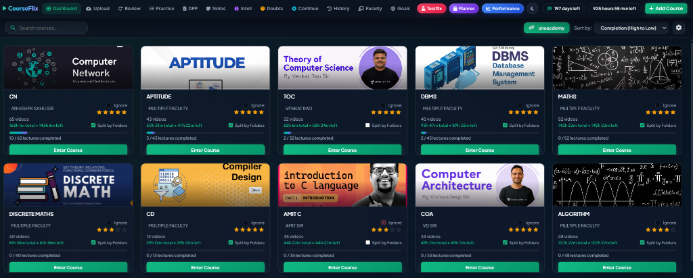

<div align="center">
  <h1>🚀 CourseFlix: The Ultimate Learning Ecosystem</h1>
  <p><strong>A Next-Generation, Hyper-Optimized Platform for Students & Lifelong Learners</strong></p>
  <br />
  
</div>

---

CourseFlix is a massive leap forward from traditional learning platforms. Built from the ground up to maximize **focus, efficiency, and retention**, it combines a state-of-the-art video player with a comprehensive suite of performance tracking, planning, and knowledge-management tools. 

Whether you are grinding through hours of lectures, tracking your long-term study goals, or organizing your personal notes and doubts, CourseFlix is engineered to be your all-in-one academic command center.

---

## ✨ Standout Features

### 📈 The Performance Dashboard (Our Crown Jewel)
Completely revamped UI and UX tailored for deep analytics. This beautifully integrated dashboard connects seamlessly with the main app to give you real-time insights into your progress.
- **Overall Completion & Intel Page:** Track your macro progress across all subjects.
- **Dynamic "Time Left" Calculations:** Calculates your remaining study time *dynamically* based on your current custom playback speed!
- **Rating System:** A fully functional and stabilized rating system to evaluate courses and lectures.
- **Intelligent Duration Toggles:** Ability to optionally ignore specific subject durations in the main course page to keep your analytics clean.

### 🎥 State-of-the-Art Video Player
Engineered for speed-watchers and power users.
- **Advanced Playback Controls:** Press `C` to speed up and `X` to slow down. Includes a custom speed selector for granular control.
- **Middle-Mouse Seek:** Effortlessly scrub through videos with a single middle-click.
- **Skip Intro & Next Lecture:** Binge your courses seamlessly without touching the mouse.
- **Lecture Finisher:** Automatically tracks and marks lectures as completed.
- **Focus Mode (Brown Noise):** Built-in Brown Noise generator with customizable volume to drown out distractions and keep you in the zone.

### 🧠 Knowledge & Doubt Management
- **Smart Doubt Dashboard:** A dedicated space for your questions, complete with a lightning-fast smart search feature.
- **Smart Drop PDF:** Drag and drop PDF notes directly into your workspace.
- **Integrated Notes Facility:** Take, save, and organize notes without ever leaving the lecture.
- **Precision Bookmarking:** Instantly bookmark crucial timestamps for quick revision.

### 📅 Planning & Navigation
- **The Goals & Planner App:** A deeply integrated planner (with recent bug fixes and stability improvements) to structure your days, weeks, and months.
- **Revamped "Continue" Page:** A massively upgraded Continue page packed with cool features to get you right back into the action.
- **History Page:** Detailed logs of your past study sessions.
- **Advanced Routing & Middle-Click:** Middle-click navigation on the navbar opens sleek new background tabs for uninterrupted flow.
- **Omni-Search Feature:** Find any course, lecture, or doubt instantly.

### 🛡️ Data Security & UI Customization
- **Auto-Backup & 24hr Auto-Export:** Never lose your data again. The app automatically safeguards your progress and allows 24-hour exports.
- **Dynamic UI Toggles:** Customize your interface on the fly.
- **Split Folder Auto-Images:** Beautiful, automatically generated cover images for split folders to keep your UI visually stunning.
- **Compact & Optimized:** A lightweight footprint ensures blazing-fast performance without draining your system resources.

---

## 💻 Extremely Detailed Installation Guide

Welcome to the CourseFlix setup guide! We have modernized the architecture to run on **Vite + React**, ensuring lightning-fast hot reloads and a premium development experience. Please follow these instructions carefully to get your environment running perfectly.

### Step 1: Install Prerequisites
Before you begin, you need **Node.js** (which includes npm, the Node Package Manager) installed on your computer.
1. Go to the official [Node.js Website](https://nodejs.org/).
2. Download and install the **LTS (Long Term Support)** version for your operating system.
3. To verify the installation, open your terminal (Command Prompt, PowerShell, or Terminal on Mac) and type:
   ```bash
   node -v
   npm -v
   ```
   *You should see version numbers printed out for both commands.*

### Step 2: Acquire the Project
If you haven't already, download the CourseFlix source code and extract it to a folder of your choice.
1. Open your terminal.
2. Navigate to the extracted folder using the `cd` command. For example:
   ```bash
   cd path/to/courceflix-react
   ```

### Step 3: Install Dependencies
This project relies on several powerful libraries (React, Vite, Tone.js, etc.). You need to download these dependencies into your local project folder.
1. Inside the `courceflix-react` directory, run the following command exactly as written:
   ```bash
   npm install
   ```
2. **Wait patiently.** You will see a progress bar as npm downloads all the required packages into a new folder named `node_modules`.

### Step 4: Start the Development Server
Once the installation is complete, you are ready to launch CourseFlix!
1. In the same terminal window, run:
   ```bash
   npm run dev
   ```
2. The terminal will quickly boot up the Vite server and display a local web address, usually looking something like this:
   ```
   ➜  Local:   http://localhost:5173/
   ```
3. **Control-Click (or Cmd-Click)** that link, or copy and paste `http://localhost:5173/` into your web browser (Chrome, Brave, Edge, etc.).

### Step 5: Import Your Data
1. Upon loading the app, navigate to the **Settings** or **Dashboard** to find the Data Import feature.
2. Drag and drop your `CourseFlix_Backup.zip` file into the application to instantly restore your progress, history, and notes!

---

### 📦 Building for Production
If you ever want to package the app for deployment (to host it on a server or distribute a compiled version), run:
```bash
npm run build
```
This will generate a highly optimized `dist/` folder containing the finalized, minified application ready for the web.

---

<div align="center">
  <i>"Perfection is not just about fixing bugs; it's about engineering an experience."</i><br/>
  <b>Built with ❤️ for serious learners.</b>
</div>
